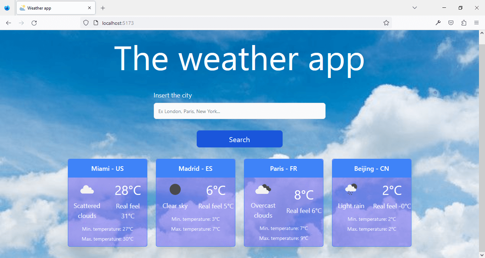
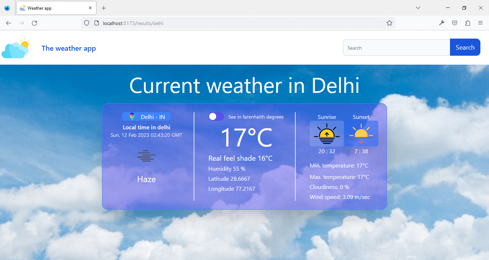

# Weather App
### Welcome to our weather app! This app has been developed using ReactJS, TypeScript, Vite and Tailwind.

&nbsp;
## Features 
- Shows current and forecast weather information for different cities.
- You can search cities by name.
- Provides detailed weather information including temperature, humidity, wind speed, and weather description.
- Allows switching between Celsius and Fahrenheit units.
- Modern and attractive design thanks to Tailwind.

&nbsp;
## Requirements
1. NodeJs and npm
2. API Key from de https://openweathermap.org/ 

&nbsp;
## Installation
### Before getting started, make sure you have NodeJS and npm installed on your computer. Then follow these steps to install and run the app:

1. Clone this repository on your computer.

1. Navigate to the app directory and run the following command to install dependencies:
    > npm install

1. Create a file in the root project ``.env``

1. Create an enviroment valiable called ``VITE_API_KEY={YOUR-API-KEY-FROM-OPENENWEATHER}``

1. Run the following command to start the app in development mode:   
    > npm run dev

1. Access the URL http://localhost:5173 in your browser to see the app in action.

&nbsp;
## Use description 
### The app is very easy to use. Simply type the name of the city you want to search for in the search field or select it on the map to see the current and forecast weather information. You can switch between Celsius and Fahrenheit at the bottom of the screen.

&nbsp;
## Homepage

&nbsp;
## Result search

&nbsp;
## License
#### This project is licensed under the MIT license.